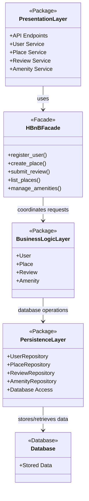

# Task 0: High-Level Package Diagram

## Mermaid Diagram

## Description

The Presentation Layer receives requests from users through API endpoints and services. Instead of directly accessing the business models, it communicates with the HBnBFacade.

The Facade pattern simplifies communication by providing one main interface to the Business Logic Layer. This reduces coupling and keeps the system easier to maintain.

The Business Logic Layer contains the core models of the application: User, Place, Review, and Amenity. These models enforce the main business rules of the system.

The Persistence Layer is responsible for saving, retrieving, updating, and deleting data from the database through repositories.
