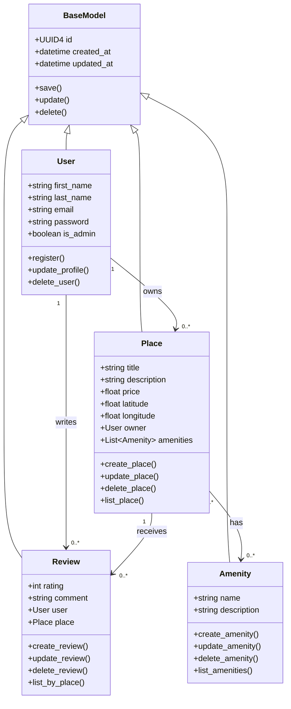

# Task 1: Detailed Class Diagram for Business Logic Layer

## Diagram

## Description

The BaseModel class contains attributes shared by all entities, including a UUID4 id, created_at, and updated_at. User, Place, Review, and Amenity inherit from BaseModel.

The User class represents registered users and administrators. A user can own many places and write many reviews.

The Place class represents a property listing. Each place belongs to one user and can receive many reviews. A place can also have many amenities.

The Review class represents feedback submitted by a user for a place. Each review belongs to one user and one place.

The Amenity class represents features that can be attached to places, such as WiFi, parking, or a pool. The relationship between Place and Amenity is many-to-many.
